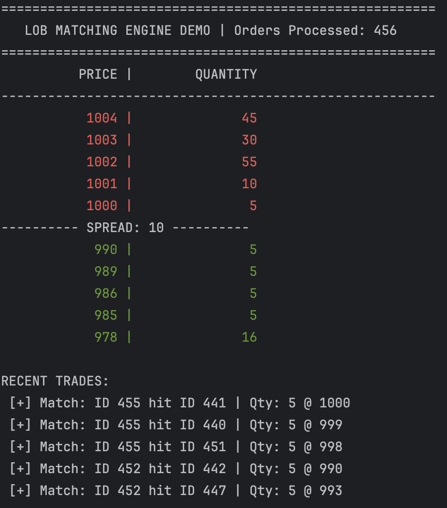

# High-Performance Limit Order Book (C++)
A deterministic, ultra-low latency Matching Engine designed for HFT applications. Optimized for the Apple M4 Pro architecture using custom memory management and cache-friendly data structures.

Demo set up in `src/main.cpp` captures snapshots of the book:

## 🚀 Performance Metrics (M4 Pro)
- Average Latency: `~36.8ns`
- p50: `0ns`
- p99: `1us`
- p99.9 Tail Latency: `1us`
- Throughput: >26.4M orders/second

See `benchmark_results` for more details

## 🛠 Key Architecture Decisions
- O(1) Order Operations: Uses a `std::unordered_map` for order lookup combined with a Custom Doubly Linked List embedded in the Order struct. This allows for $O(1)$ cancellations without searching price levels.
- Fixed-Point Arithmetic: Prices are handled as int64_t (scaled by $10^4$) to eliminate floating-point non-determinism and rounding errors.
- Zero Dynamic Allocation (Object Pool): Implemented a pre-allocated OrderPool with a Free List to eliminate malloc/free during the matching cycle, preventing OS-level latency spikes.
- Observer Pattern: Decoupled trade execution from notification logic via the ITradeObserver interface, allowing for pluggable logging or market data publishing.

## 🏗 Data Structure
The book utilizes a Map of Pointers to Linked Lists approach:

- `std::map<Price, LimitLevel*>` for price-sorted levels.
- Internal linked lists for Time Priority (FIFO) matching.