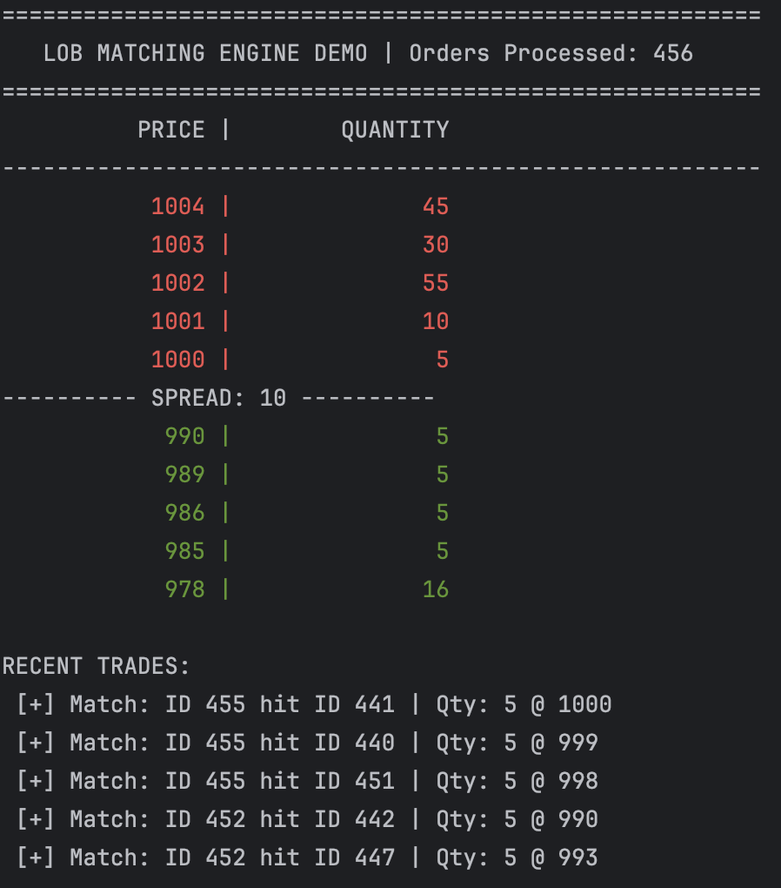

# High-Performance Limit Order Book (C++)
An end-to-end implementation of market microstructure mechanics, ranging from zero-allocation binary parsing of NASDAQ ITCH 5.0 market data to deterministic order matching and quantitative alpha research.

## Executive Summary
* **Domain Focus:** Quantitative Finance and High-Frequency Trading (HFT) Infrastructure
* **Core Features:** Deterministic, ultra-low-latency Matching Engine designed for HFT applications along with comprehensive research suite.
* **Tech Stack:** Modern C++20, Python, CMake, Docker, Google Test, Google Benchmark, and RapidCheck
* **Performance Peak:** Throughput of >26.4M ops with average latency of ~36.8ns per operation on Apple M4 Pro architecture

Snapshot of the book:

## 🚀 Performance Metrics (M4 Pro)
- Average Latency: `~36.8ns`
- p50: `0ns`
- p99: `1us`
- p99.9 Tail Latency: `1us`
- Throughput: >26.4M orders/second

See `benchmark_results` for more details

## 🛠 Low-Latency Architecture & Optimizations
* **Zero Dynamic Allocation (Object Pooling):** The system completely eliminates OS-level malloc and free calls during the live matching cycle. It relies instead on a pre-allocated OrderPool and LimitPool managed via a Free List to prevent unexpected latency spikes.
* **O(1) Order Operations:** Order tracking utilizes a std::unordered_map for lookup combined with a Custom Doubly Linked List embedded directly within the Order struct itself. This custom data layout enables $O(1)$ algorithmic complexity for order cancellations without the need to iterate through individual price levels.
* **Price Level Tracking:** The limit order book utilizes a Map of Pointers to Linked Lists structural approach, employing std::map<Price, LimitLevel*> for sorted price levels. Internal linked lists then strictly enforce deterministic Time Priority (FIFO) matching.
* **Deterministic Fixed-Point Math:** To safely eliminate floating-point non-determinism and inherent rounding errors, all internal price operations are processed as int64_t fixed-point integers scaled by $10^4$.
* **Zero-Copy Ingestion:** Employs a custom MmapReader memory-mapped file abstraction to map and parse raw binary ITCH 5.0 messages directly from disk without copying into user space.
* **Lock-Free Concurrency Concepts:** Implements Single-Producer Single-Consumer (SPSCQueue) ring buffers to gracefully decouple the critical deterministic matching thread from asynchronous background tasks.

## Market Data Integration & Quantitative Analytics
Using the described infrasturcture, this repository bridges software engineering with quantitative financial research.
* **ITCH 5.0 Protocol Decoding:** Fully supports tracking complex state reductions via strict NASDAQ ITCH 5.0 protocols. The engine correctly parses and reacts to standard messages including AddOrder, CancelOrder, OrderDelete, and OrderExecutedWithPrice.
* **Live Order Flow Imbalance (OFI):** Features a real-time OFICalculator that utilizes a synchronous Observer pattern (IBookObserver) to dynamically monitor book updates. It efficiently manages state pruning of trades across concurrent rolling 1-second, 5-second, and 30-second time windows.
* **OFI Signal Replication (Cont et al. 2014):** Contains a dedicated Python analytics pipeline (cont.py) that successfully replicates Cont's renowned academic paper on OFI as a mid-price predictor. By processing historical 2019 AAPL ITCH data, the pipeline achieved an $R^2$ value of $0.605$ on a 1-second horizon, deeply matching the original paper's findings for equities.

## Engineering Standards
* **Comprehensive Unit Testing:** Employs Google Test (gtest) to meticulously cover edge-case business logic, including complex modifications where a trader increasing their order quantity or changing their limit price properly loses time priority in the queue. Test cases carefully enforce separation of concerns by manually injecting dummy data structures into queues to test asynchronous writing without spinning up complex order book dependency states.
* **Property-Based Fuzzing:** RapidCheck is deeply integrated to continuously generate randomized order flow payloads, rigorously verifying critical system invariants such as validating that "No Order Matches Itself".
* **Continuous Integration:** Strict build health is automatically enforced on pushes via .github/workflows/ci.yml.
* **Code Coverage Verification:** Uses bash shell scripts (run_coverage.sh) coupled with gcovr to output detailed HTML reports and enforce high testing coverage standards directly over the core matching engine logic.

## 🔧 Getting Started
TBD...