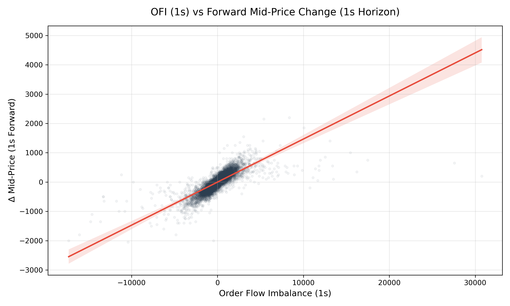

# Analytics
## OFI as Mid-Price Predictor


```
--- Cont 2014 Replication Summary ---
horizon    R^2     Beta  t-stat  p-value
     1s 0.6050 0.146921  188.14      0.0
     5s 0.1671 0.187095   68.08      0.0
    30s 0.0346 0.206632   28.78      0.0
   1min 0.0204 0.227997   21.95      0.0
-------------------------------------
```

Successful replication of Cont et al. 2014 on 2019 AAPL ITCH data. $R^2$ value of $0.605$ on a 1-s horizon, consisten with their equity findings. 